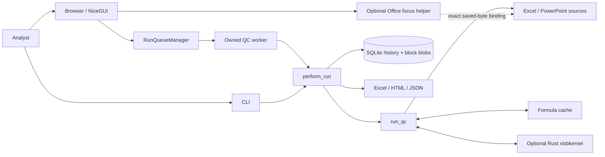
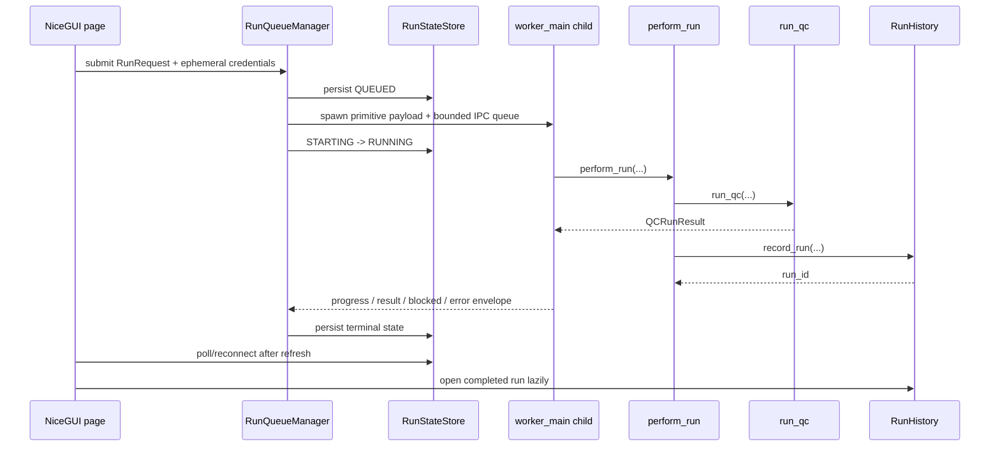
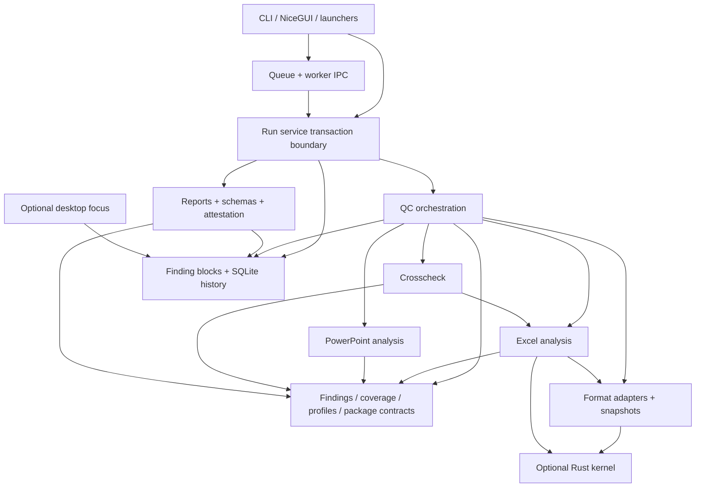
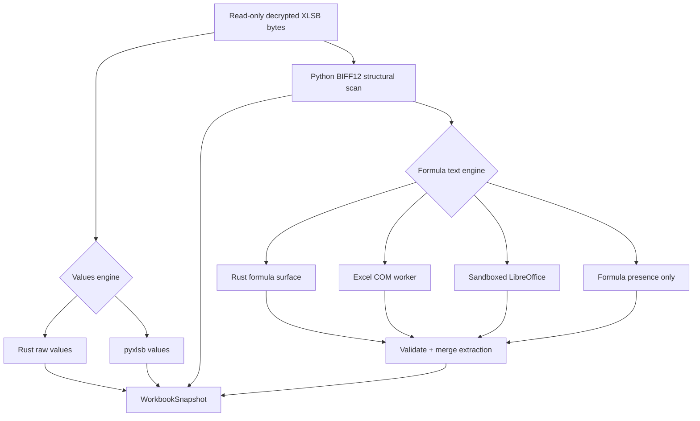
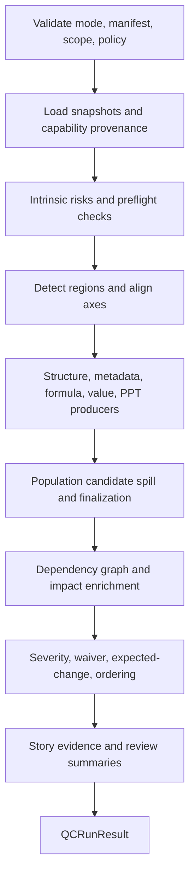

# QC Tool Architecture

**Project:** `cadence-diff` (import package `qc_tool`)  
**Architecture baseline:** `main@e1480b3`  
**Runtime:** Python 3.11 or 3.12; optional Rust/PyO3 `xlsbkernel`  
**Primary deployment:** local, single-user NiceGUI application bound to loopback  
**Data posture:** read-only source processing, local persistence, no LLM or remote analysis service

This document describes the production architecture as implemented in the live
repository. It is an engineering map: where responsibilities live, how data
moves, which boundaries are security- or memory-sensitive, and how to extend the
system without breaking its evidence contracts.

## 1. Purpose And Architectural Drivers

QC Tool performs local quality control on recurring Excel and PowerPoint
deliverables. It supports three workflows:

| QC mode | Inputs | Architectural emphasis |
|---|---|---|
| `current_file_preflight` | Current Excel workbook member(s) and/or current PPT | Intrinsic checks without a baseline |
| `cycle_comparison` | Baseline/current Excel member pairs and/or PPT pair | Alignment, change detection, expected cadence growth, Re-QC |
| `final_package` | Current Excel member(s) plus current PPT | Excel-to-PowerPoint claim reconciliation |

The design is shaped by several non-negotiable constraints:

1. **Source files are immutable inputs.** The engine reads and hashes them; it
   never saves changes back to them.
2. **A missing capability is not a pass.** Every check reports `checked`,
   `degraded`, `unavailable`, or `not_included` coverage. The last state means
   the artifact or workflow was intentionally outside this run, not that
   analysis of a supplied input failed.
3. **Atomic evidence remains authoritative.** Review groups, stories, series
   lenses, and population findings are projections over evidence, not alternate
   sources of truth.
4. **Large runs must be bounded.** Findings, population candidates, history,
   and UI reads use compressed blocks, streaming passes, caps, or child
   processes rather than whole-run materialization.
5. **The app is local-first and privacy-sensitive.** Managed data is
   current-user-only; queue messages are primitive-only; failures are sanitized;
   optional Office navigation is explicitly gated.
6. **Cross-platform behavior degrades coherently.** OOXML is native Python;
   XLSB can use the optional Rust kernel, Excel COM, LibreOffice, or safe
   presence-only fallbacks depending on capability.

## 2. System Context

QC Tool is a **modular monolith**, not a distributed service. The web server,
queue supervisor, history database, and report generators are local processes
or modules. Heavy QC executes in an owned child process when launched from the
UI. The CLI uses the same service and engine synchronously.

There are no application data APIs exposed to remote clients. NiceGUI owns the
local HTTP/WebSocket surface. The default bind address is `127.0.0.1`; temporary
LAN mode is an explicit, separately governed operating mode.

## 3. Runtime Topology And Entry Points

### 3.1 Entry Points

| Surface | Entry point | Responsibility |
|---|---|---|
| Installed CLI | [`qc_tool/cli.py`](qc_tool/cli.py) `main()` | Dispatch `serve`, authenticated `launch`, `run`, sanitization, fingerprinting, attestation verification, network, profile lint, shortcut, and cache commands |
| Module launch | [`qc_tool/__main__.py`](qc_tool/__main__.py) | `python -m qc_tool` compatibility entry |
| Source-tree launch | [`main.py`](main.py) | Development launch using repository-local data flow |
| NiceGUI app | [`qc_tool/ui/app.py`](qc_tool/ui/app.py) `run_app()` / `create_pages()` | Browser pages, session state, uploads, queue control, review UI, on-demand exports, sign-off |
| QC worker | [`qc_tool/worker.py`](qc_tool/worker.py) `worker_main()` | Spawn-safe, UI-free execution of one queued request |
| Office focus helper | [`qc_tool/focus/worker.py`](qc_tool/focus/worker.py) | Isolated Office discovery/navigation protocol |
| Windows formula helper | [`qc_tool/io/excel_formula_worker.py`](qc_tool/io/excel_formula_worker.py) | Bounded Excel COM formula extraction for XLSB fallback/enrichment |

The installed console scripts `cadence-diff` and `qc-tool` both resolve to
`qc_tool.cli:main` through [`pyproject.toml`](pyproject.toml).

### 3.2 UI Execution Path

[`RunQueueManager`](qc_tool/runqueue.py) provides a process-global, per-data-
directory FIFO with exactly one heavy worker slot. It persists lifecycle state
before launching the child so browser refreshes and additional tabs reconnect
to the same request rather than launching duplicate work.

Credentials are held only in memory. A password-protected request is refused if
it would have to wait in the queue. After spawn, the manager clears its copy.
The worker clears its copy in `finally`.

Cancellation escalates in three steps:

1. set the cooperative cancellation flag;
2. terminate after the grace period;
3. kill if the process still does not exit.

The worker also monitors parent liveness. If its owner disappears, it cancels
itself and does not emit a result that no manager is waiting to receive.

### 3.3 CLI Execution Path

The headless `run` command calls [`perform_run()`](qc_tool/run_service.py)
directly. It does not use the UI queue. The service and engine are otherwise the
same. CLI runs can request eager Excel/HTML report generation; UI runs defer
reports to on-demand generation from the run page.

### 3.4 Authenticated Local Launcher

[`qc_tool/launcher.py`](qc_tool/launcher.py) prevents the convenience `launch`
command and desktop shortcut from confusing an unrelated listener with a live
QC Tool instance. A serving process exclusively locks its data directory,
creates a private atomic instance marker containing its port and random secret,
and answers a loopback health challenge with an HMAC proof. The launcher reads
the marker, sends only a fresh challenge, and reuses the instance only when the
proof and schema version match.

A separate launch-request lock serializes concurrent launch attempts. If no
authenticated instance exists, the launcher refuses an occupied port or starts
this Python environment in local, no-browser child mode and waits for the same
proof. Outcomes distinguish `started`, `reused`, `in_progress`,
`port_occupied`, `start_failed`, and `start_timeout`. Child startup diagnostics
go to a private bounded rotating log rather than an attached console.

## 4. Layering And Dependency Direction

The intended dependency direction is inward toward stable contracts:

- **Entry layers** may depend on services and models.
- **`run_service.py`** may depend on the engine, history, reports, security,
  hashing, and cache setup. It deliberately has no NiceGUI imports.
- **`engine.py`** owns workflow orchestration and may call format-neutral IO,
  Excel/PPT producers, crosschecks, triage, story, and spill storage.
- **Domain contracts** (`findings.py`, `coverage.py`, `package.py`, profile
  models, snapshot models) do not depend on the UI.
- **Format adapters** populate snapshots; they do not decide analyst severity or
  review layout.
- **Reports and UI** consume persisted/domain models; they do not own detection.
- **Optional native code** sits behind Python adapters and is never imported by
  callers directly.

The largest intentional orchestration modules are
[`qc_tool/engine.py`](qc_tool/engine.py) and
[`qc_tool/ui/app.py`](qc_tool/ui/app.py). New business logic should usually go
into a focused producer/model module and be called from these orchestrators,
rather than expanding them with a second implementation of the rule.

## 5. Canonical Domain Contracts

### 5.1 Run Modes And Coverage

[`qc_tool/coverage.py`](qc_tool/coverage.py) defines:

- `QCRunMode`: preflight, cycle comparison, final package;
- `FindingOutputMode`: profile, decision, atomic;
- `CoverageState`: checked, degraded, unavailable, not included;
- `CoverageItem`: one capability/check verdict;
- `MappingCoverage`: explicit denominator and reconciliation counts for
  Excel-to-PowerPoint mapping.

Coverage is part of the run result, history, reports, and attestation. A low
finding count is not interpreted as clean if a relevant check is unavailable.
Checks marked not included remain visible but do not make capability limited or
require a sign-off acknowledgement.

### 5.2 Package Identity

[`PackageManifest`](qc_tool/package.py) is the path-free, credential-free
identity contract for multi-file runs. Its members are frozen and canonicalized
by side, artifact type, and stable member ID.

Important invariants:

- maximum eight Excel members per side;
- maximum one PowerPoint member per side;
- unique `(side, artifact, member_id)` identities;
- exact parity between manifest role keys and provided paths;
- `primary` preserves legacy role names; other members use role keys such as
  `current_excel:operations`.

The manifest persists into history, reports, attestations, findings, alignment
trust, and crosscheck ownership. File paths are not part of the manifest.

### 5.3 Profile Contract

[`DeliverableProfile`](qc_tool/config/profile.py) is the versioned behavior
contract. It contains:

- numeric tolerance and restatement windows;
- workbook/member/sheet-specific rules;
- controls, prerequisites, row identities, ignored areas, availability rules;
- PPT slide matching, required slides, chart windows, and draft tokens;
- Excel-to-PowerPoint mappings;
- severity overrides and expiring waivers;
- the versioned review/population policy.

Profiles are Pydantic models. `canonical_profile_json()` and
`profile_sha256()` define the stable evidence hash. Run-level output-mode
choices do not mutate the profile or alter this hash.

### 5.4 Output Policy

Finding output is orthogonal to QC mode:

| Output mode | Effective behavior |
|---|---|
| `profile` | Use the profile's persisted population policy exactly |
| `decision` | Use the profile policy if enabled; otherwise use the versioned conservative built-in population policy |
| `atomic` | Force population output off |

`resolve_output_policy()` creates a deeply frozen, independent
`ResolvedOutputPolicy`. Both the requested mode and resolved policy persist in
history, JSON, reports, and attestations. Re-QC only computes a resolved/new
delta when the two runs' representations are provably compatible.

### 5.5 Workbook Snapshot

[`WorkbookSnapshot`](qc_tool/io/model.py) is the common contract consumed by
Excel analysis regardless of source format. It contains:

- `SheetSnapshot` objects and populated `CellRecord` values;
- formula text, optional adapter-supplied R1C1, number formats, and style keys;
- named ranges, formula ranges, tables, pivots, charts, data validation, and
  conditional formatting;
- calculation metadata, intrinsic package risks, VBA and package metadata;
- workload metrics and capability flags;
- formula and values engine provenance;
- explicit formula-text completeness and external-link reachability verdicts.

Unsupported format capabilities remain absent or false and are accompanied by
coverage/detail fields. They are not fabricated by the loader.

### 5.6 PowerPoint Snapshot

[`qc_tool/ppt/model.py`](qc_tool/ppt/model.py) defines the normalized deck,
slide, shape, table, chart, note, figure, and media contracts. Extraction is
owned by [`qc_tool/ppt/extract.py`](qc_tool/ppt/extract.py); matching and
comparison are separate modules.

### 5.7 Finding And Run Result

[`Finding`](qc_tool/findings.py) is the canonical evidence unit. Among its
axes are:

- artifact and stable package member;
- finding class, location, sheet/slide, baseline location;
- baseline/current evidence;
- engine severity, analyst override, waiver, provenance, materiality, and
  temporal context;
- evidence tags, event/subtype, impacts, excerpts, and optional population;
- private sidecar fields for desktop focus, counterfactual evidence, and series
  anchors.

[`QCRunResult`](qc_tool/engine.py) carries the complete run contract: mode,
profile, requested/resolved output policy, files, engine provenance, findings,
coverage, mappings, scope, alignment trust, package manifest, disclosures, and
cached severity counts.

## 6. Input Normalization

### 6.1 Common Intake

[`load_workbook_snapshot()`](qc_tool/io/loader.py) dispatches by extension after
read-only decryption/intake checks. Before expensive parsing, loaders collect
workload evidence and can refuse pathological packages unless the operator
explicitly overrides the workload gate.

`perform_run()` hashes all source roles before QC, rejects byte-identical inputs
where the mode makes them meaningless, and hashes them again after QC. A source
change during the run fails the transaction.

### 6.2 OOXML (`.xlsx`, `.xlsm`)

The production loader uses a streaming worksheet path to reduce memory. A
separate openpyxl oracle path exists for parity testing. Raw OOXML helpers own
structure that openpyxl either does not expose fully or can normalize:

- [`ooxml_worksheet.py`](qc_tool/io/ooxml_worksheet.py): physical worksheet
  cells and metadata;
- [`ooxml_names.py`](qc_tool/io/ooxml_names.py): workbook/sheet-scoped names;
- [`ooxml_chart.py`](qc_tool/io/ooxml_chart.py): chart graph and anchors;
- [`ooxml_interaction.py`](qc_tool/io/ooxml_interaction.py): data validation and
  conditional formatting;
- [`ooxml_metadata.py`](qc_tool/io/ooxml_metadata.py): package metadata,
  comments, connections, queries, and media relationships;
- [`vba.py`](qc_tool/io/vba.py): VBA project/module inventory and safe source
  evidence.

OOXML formulas are read from the package itself. External Office applications
are not needed for ordinary OOXML formula text.

### 6.3 XLSB (`.xlsb`)

XLSB has two distinct native concerns that must not be conflated:

1. **Snapshot extraction**: decode values and formula surfaces into the common
   workbook snapshot.
2. **Formula-delta classification**: accelerate comparison of already-extracted
   baseline/current formula strings.

The load path is:

[`qc_tool/io/native_kernel.py`](qc_tool/io/native_kernel.py) is the defensive
optional-import boundary. [`qc_tool/io/native_formula.py`](qc_tool/io/native_formula.py)
validates vector lengths, definition IDs, and R1C1 consistency before merging
the Rust surface. An adapter failure never turns malformed text into trusted
formula evidence.

`formula_engine="auto"` prefers the native formula surface when the extension
is present, then uses the platform fallback policy. Values `auto` also prefers
native, but may fall back to pyxlsb with an explicit disclosure. An explicitly
requested unavailable engine fails or degrades according to the values/formula
contract; it is never silently reported as the requested engine.

The extraction cache in [`formula_cache.py`](qc_tool/io/formula_cache.py) is
private, content-addressed, schema-versioned, and bounded. Engine fingerprints
are part of cache identity so results from different adapters do not collide.

### 6.4 Native Formula-Delta Comparison

After formulas have been extracted and normalized, cycle comparison can batch
formula pairs into the Rust classifier in
[`native/xlsbkernel/src/formula_delta.rs`](native/xlsbkernel/src/formula_delta.rs).
This is separate from XLSB extraction and also accelerates comparisons whose
formula text arrived through other adapters.

The Python boundary enforces:

- maximum 50,000 occurrences per batch;
- maximum 16 MiB exact UTF-8 formula payload per batch;
- maximum 32,768 UTF-8 bytes per individual raw/normalized string;
- explicit Python fallback for unsupported or malformed rows;
- propagation of `MemoryError` rather than retrying with a second expensive
  implementation;
- fixed aggregate counters for API, protocol, runtime, unsupported, malformed,
  oversized, supported, and fallback outcomes.

Rust runs one GIL-detached batch call. It computes extension and added-reference
facts from raw formulas, while deduplicating only wrapper analysis that is a pure
function of normalized formulas.

### 6.5 PowerPoint

[`load_deck_snapshot()`](qc_tool/ppt/extract.py) uses `python-pptx` plus direct
OOXML chart/media helpers. It extracts stable shape identities, text, tables,
charts, notes, figure occurrences, and embedded media digests. Rendered visual
comparison and OCR are deliberately unavailable; coverage reports that boundary.

## 7. QC Orchestration

[`run_qc()`](qc_tool/engine.py) is the domain orchestrator. It accepts either
legacy role paths or a canonical package manifest and drives all three QC modes.

### 7.1 Logical Pipeline

The exact producer mix depends on mode. Progress phases are exposed through
[`qc_tool/progress.py`](qc_tool/progress.py); phase names are a stable
observability contract, not separate services.

### 7.2 Current-File Preflight

The preflight path runs intrinsic workbook and/or deck checks. For Excel,
[`preflight_workbook()`](qc_tool/excel/preflight.py) checks formula errors and
consistency, structural/package risks, controls, availability, names, charts,
interactions, and capability boundaries without a baseline alignment.

### 7.3 Cycle Comparison

The cycle path:

1. checks comparison prerequisites before diffing;
2. builds workbook region alignment and an alignment-trust manifest;
3. pauses with a bounded run action if an unconfigured ranked table requires
   analyst-confirmed row identity;
4. runs structure, metadata, formula, value, PPT, and package-member producers;
5. optionally groups eligible homogeneous changes into population findings;
6. enriches retained evidence with impacts and context;
7. applies severity, waiver, story, and review projections.

The post-diff candidate merge, population construction or replay, sample
enrichment, and final finding-block assembly report as the explicit
`finalizing_findings` phase. `building_review` begins only after that work is
complete, so long population finalization is not an unnamed progress gap.

[`qc_tool/excel/align.py`](qc_tool/excel/align.py) owns alignment. It detects
long, wide, and block regions, aligns axes by stable keys when justified, uses
confirmed `RowIdentityRule` contracts for ranked/sorted tables, and records
method/confidence/skipped/unpaired facts in a versioned trust manifest.

### 7.4 Final Package

Final-package QC loads one current deck and observes current Excel members one
at a time through [`MultiPackageReconciler`](qc_tool/crosscheck/package.py).
Confirmed mappings are profile contracts. Suggestions are bounded analyst aids,
not autonomous reconciliation. Cross-workbook formulas are inventoried but not
followed or evaluated.

### 7.5 Multi-Member Execution

`_run_multi_package()` in the engine projects the shared profile into each
Excel member, invokes the existing single-member pipeline sequentially, retags
findings/coverage/trust by member, and merges once. This keeps one implementation
of Excel QC.

Ranked-table blocks are collected across all paired members before raising one
bounded action. Selection is round-robin under the action-item cap so one noisy
member cannot hide every other blocked member.

## 8. Producers, Enrichment, And Review Projections

### 8.1 Excel Producers

The main Excel production modules are:

- [`diff_structure.py`](qc_tool/excel/diff_structure.py): sheets and structural
  insert/delete/change events;
- [`diff_metadata.py`](qc_tool/excel/diff_metadata.py): workbook metadata,
  names, tables, charts, comments, connections, and related state;
- [`diff_vba.py`](qc_tool/excel/diff_vba.py): VBA module evidence without
  putting macro source into findings;
- [`formulas.py`](qc_tool/excel/formulas.py): formula errors, hardcodes,
  removals, logic changes, extensions, missing formulas, and consistency;
- [`diff_values.py`](qc_tool/excel/diff_values.py): values, number formats,
  styles, acceptance bands, availability, and expected cadence behavior;
- [`controls.py`](qc_tool/excel/controls.py): required, unique, bounds, and
  tie-out contracts;
- [`interaction.py`](qc_tool/excel/interaction.py): validation and conditional
  formatting changes;
- [`workbook_risks.py`](qc_tool/excel/workbook_risks.py): package-level risks
  and external-link semantics.

All producers return or stream `Finding` objects. They do not write history or
render UI.

### 8.2 PowerPoint Producers

[`qc_tool/ppt/`](qc_tool/ppt) separates extraction, slide matching, element
matching, element diffing, deck diffing, repetition checks, and preflight. Slide
order and shape identity are distinct axes, allowing insertion/reordering to be
reported without cascading positional noise.

### 8.3 Dependencies And Impacts

[`qc_tool/excel/dependency.py`](qc_tool/excel/dependency.py) owns a compact
formula dependency graph. Large ranges remain symbolic rather than expanding to
every concrete edge. Size policy can skip dependency/circular analysis with
explicit degraded coverage; an operator can force it separately from workbook
load overrides.

Impact enrichment is evidence decoration. It does not decide whether the
underlying finding exists.

### 8.4 Triage

[`qc_tool/triage/rules.py`](qc_tool/triage/rules.py) assigns engine severity,
applies profile overrides and waivers, preserves expected-change semantics, and
defines deterministic sort keys. Materiality and temporal context remain
independent axes so an analyst can distinguish magnitude from provenance.

### 8.5 Population Output

Only the closed set `formula_logic_changed` and `number_format_changed` is
population-eligible. [`CandidateSpill`](qc_tool/excel/population.py):

1. assigns the same severity/waiver projection atomic mode would use;
2. computes the population key and shape digests;
3. delta-encodes candidates against bounded templates;
4. externally sorts candidates by group and coordinate;
5. streams capped geometry, sample, and homogeneity state;
6. emits one population or replays the exact atomic findings.

Critical bounds include:

- at most 4,096 in-memory candidate templates;
- profile-defined rectangle and explicit-pair caps;
- at most five retained representative samples;
- lazy block-backed population and replay sequences;
- no whole-group list of full `Finding` objects for accepted large populations.

If evidence tags, event identity, or other required group facts are
heterogeneous, the group is replayed atomically. Decision mode therefore changes
representation, not QC coverage.

### 8.6 Review Groups, Series, And Stories

These are analyst-facing projections:

- [`review.py`](qc_tool/review.py): spatial and semantic grouping, priority;
- [`review_stream.py`](qc_tool/review_stream.py): streaming summaries and view
  aggregates;
- [`review_series.py`](qc_tool/review_series.py): related-time-series lens;
- [`story.py`](qc_tool/story.py): evidence-linked change stories and residuals.

They never replace evidence or silently remove it. Analyst summaries distinguish
decision items, stored finding records, and represented changes. The legacy
`atomic_findings` machine field remains a finding-record count for compatibility;
population evidence carries verifiable membership metadata.

## 9. Bounded-Memory Architecture

### 9.1 Finding Blocks

[`qc_tool/findings_store.py`](qc_tool/findings_store.py) defines the `QCFB1`
block format:

- findings are encoded as compact JSONL;
- blocks are zlib-compressed;
- a JSON footer indexes block offsets and counts;
- default block size is 5,000 rows;
- multi-run external merge has bounded fan-in;
- `FindingSequence` provides lazy iteration and random access with an LRU block
  cache.

`finding_payload()` preserves private spill fields that normal public
`model_dump()` excludes. History stores the public projection in finding blocks
and persists private evidence in dedicated sidecars.

### 9.2 Engine Streaming

The cycle engine partitions production work into bounded parts. Value findings
are generated by region chunks. Workbook cell dictionaries can be released
after their last dependent region. Global triage order is restored through
external merge rather than by retaining the whole run.

### 9.3 UI Memory Boundary

Completed runs load through lazy `FindingSequence` objects. Large result pages
use stored summaries and paged atomic evidence rather than building every group
and detail object in the NiceGUI server. Focus sidecar decode is capped; an
oversized sidecar degrades focus capability instead of consuming multiple GiB.

Population excerpt generation that must reopen source workbooks runs in a
short-lived owned process with timeout/terminate/kill cleanup. The UI server
does not load two large workbook snapshots to render an excerpt.

### 9.4 Process Boundary

The UI worker process is the memory reclamation boundary for a run. On success,
failure, cancellation, or server shutdown it is joined and closed before the
single slot is released.

## 10. Persistence Model

One private SQLite database, normally `history.sqlite3`, holds both active
request state and completed history. WAL mode and a 30-second connection
timeout support concurrent UI, supervisor, and worker access.

### 10.1 Active Request State

[`qc_tool/history/run_state.py`](qc_tool/history/run_state.py) owns `run_state`.
It stores:

- request ID, lifecycle status, queue position, mode, profile, display filenames;
- progress phase/count/detail and phase telemetry;
- cancellation, terminal error, completed run ID;
- bounded `action_required` data for blocked runs;
- requested finding-output mode.

It never stores passwords, source paths, formulas, findings, or source content.
On server startup, active rows from the prior server process are marked
orphaned; workers are not blindly resumed.

### 10.2 Completed Runs And Review State

[`qc_tool/history/store.py`](qc_tool/history/store.py) owns:

| Table | Purpose |
|---|---|
| `runs` | Run metadata, hashes/paths, counts, coverage, modes/policies, profile snapshot/hash, provenance, manifests, disclosures, storage accounting |
| `run_finding_blocks` | Compressed public finding blocks |
| `run_focus_blocks` | Block-aligned focus sidecars |
| `run_view_summaries` | Bounded review/pattern/story summaries |
| `annotations` | Analyst severity overrides and comments |
| `run_signoffs` | Immutable finalization metadata and report/attestation references |
| `counterfactual_bases` | Private counterfactual evidence by finding |
| `series_anchor_sidecars` | Private time-series continuity evidence |
| `annotation_lineage` | Many-to-one Re-QC carry-forward provenance |
| `review_sessions` | Explicit review timer sessions |
| `decision_occurrences` / `decision_origins` | Longitudinal contract occurrence and decision provenance |
| `contract_promotions` | Review-to-profile promotion audit |

Schema migration is additive and guarded by `PRAGMA table_info`. Legacy runs
receive conservative defaults rather than guessed provenance or policy.

### 10.3 Re-QC

Re-QC always creates a new run linked by `rerun_of`. The source run remains
immutable. Carry-forward is explicit and evidence-digest-gated.

`compare_findings()` uses multiset semantics. UI/service callers suppress a
delta when output representations are incompatible, including requested-mode
changes, effective-policy changes, and observed population/atomic changes.

## 11. Reports, Schemas, Sign-Off, And Attestation

### 11.1 Report Generation

[`qc_tool/report/`](qc_tool/report) owns rendering:

- `excel_report.py`: analyst-facing workbook;
- `html_report.py`: self-contained HTML;
- `json_report.py`: machine-readable evidence and optional review summaries;
- `findings*.schema.json`: public JSON contracts.

UI reports are on demand. CLI callers can set `write_reports=True` and generate
them during `perform_run()`.

JSON schema selection is additive: the writer chooses the schema version needed
by the evidence present (for example, population evidence) while retaining
legacy compatibility.

### 11.2 Sign-Off

[`finalize_run()`](qc_tool/signoff.py) is an immutable publication transaction:

1. assert the run is mutable and all Critical/Warning items are decided;
2. require acknowledgement for every non-checked coverage item and every
  nonzero mismatched, unresolved, unmapped, or unavailable mapping count;
3. verify the exact profile hash and every current source hash;
4. regenerate final Excel/HTML reports from reviewed history;
5. create and immediately verify the signed attestation;
6. atomically rename temporary artifacts into final paths;
7. persist the sign-off and stop the review timer.

Any failure removes temporary and partially published files.

### 11.3 Attestation

[`qc_tool/attestation.py`](qc_tool/attestation.py) creates private ZIP bundles
signed with HMAC-SHA256. The manifest binds:

- canonical profile bytes and hash;
- input names, sizes, and hashes;
- evidence/report member hashes and sizes;
- run mode, coverage, counts, engine provenance, and output policy;
- analyst decisions and waivers;
- optional sign-off, package manifest, population manifest, and annotation
  lineage.

Verification is cumulative and presence-driven. Higher schema tiers do not
skip lower-tier feature validation. The local key is current-user-only.

## 12. NiceGUI Application Architecture

[`create_pages()`](qc_tool/ui/app.py) registers four primary pages:

| Route | Purpose |
|---|---|
| `/` | Mode, inputs, profile, scope, output policy, queue submission, current result |
| `/guide` | Packaged task-oriented guide |
| `/history` | Search/filter/archive/export/delete run history |
| `/runs/{run_id}` | Persisted run review, reports, Re-QC, carry-forward, sign-off |

The UI does not call detection modules directly. It builds a `RunRequest`,
submits it to `RunQueueManager`, then renders persisted `RunStateRecord` and
`RunRecord` models.

Pure UI state transformations that warrant direct testing live outside the
monolithic page function. For example,
[`ranked_table_dialog.py`](qc_tool/ui/ranked_table_dialog.py) owns row-identity
dialog state, validation, duplicate policy, optimistic profile concurrency, and
profile updates without importing NiceGUI.

## 13. Desktop Office Focus

Desktop focus is a separate optional subsystem under [`qc_tool/focus/`](qc_tool/focus).
It is navigation, not QC. It never changes run evidence.

Key properties:

- Windows-only and loopback-only;
- explicit launch/setting consent;
- exact saved-byte matching to the run's role hash;
- explicit per-client confirmation before a binding becomes active;
- single-use, five-minute action tokens tied to render revision;
- ten-minute in-memory bindings, never persisted to SQLite or reports;
- pre- and post-dispatch hash/identity revalidation;
- refusal for managed copies, active content, encrypted/unsupported packages,
  Protected View, AutoSave, ambiguous documents/windows, changed identity, and
  incomplete enumeration;
- cleartext paths stay server/helper-side; the browser receives fixed outcomes
  and tokens, not authority-bearing locators.

[`FocusService`](qc_tool/focus/service.py) is UI-free orchestration.
[`binding.py`](qc_tool/focus/binding.py) owns exact saved-byte identity.
[`navigator.py`](qc_tool/focus/navigator.py) owns helper invocation. Excel and
PowerPoint navigation have separate adapters.

## 14. Security And Privacy Boundaries

### 14.1 Filesystem

[`qc_tool/security.py`](qc_tool/security.py) applies:

- POSIX `0700` managed directories and `0600` managed files;
- Windows current-user-only DACLs;
- no symlink following during managed-tree hardening.

Reports, SQLite, cache entries, keys, and managed run directories use these
helpers.

### 14.2 Source Safety

- sources are opened read-only or copied/decrypted into private temporary space;
- pre/post SHA-256 checks detect mutation;
- Office formula extraction uses bounded helpers and cleanup of owned processes;
- macros, queries, links, and connections are inventoried but never executed or
  refreshed;
- connection strings/commands are represented by fixed classifications and
  digests rather than copied into findings.

### 14.3 Process And IPC Safety

Worker messages are versioned dictionaries containing primitive progress,
terminal status, sanitized errors, run IDs, or bounded action-required data.
Findings and source contents do not cross the queue. Progress can be dropped
when the bounded channel is full; the single terminal result is delivered with
a bounded timeout.

### 14.4 Network

The default server is loopback-only. Temporary LAN mode is explicit and
time-bounded. Desktop focus is available only in `NetworkMode.LOCAL` loopback
mode and is disabled whenever LAN exposure is enabled.

### 14.5 Sanitization Tools

Sanitization and structural fingerprinting are separate CLI workflows, not part
of run execution. Strict redaction is fail-closed and recursively verifies
OOXML/package content before an artifact is considered shareable.

## 15. Failure And Degradation Semantics

The system distinguishes four outcomes:

| Outcome | Meaning |
|---|---|
| Finding | QC ran and found evidence requiring classification/review |
| Degraded/unavailable coverage | A capability could not prove its normal claim |
| Blocked run | Inputs/configuration require analyst action before a meaningful run |
| Failed/cancelled run | Execution did not produce a completed evidence set |

`RunBlockedError` carries a bounded, value-free `RunActionRequired` payload.
Examples include mismatched comparison prerequisites and ranked-table identity
confirmation. A blocked run writes no completed history row or reports.

Optional native and external adapters fail closed:

- values `auto` can fall back to pyxlsb with provenance/disclosure;
- formula enrichment can degrade to structural presence-only coverage;
- native formula-delta rows can fall back individually to Python;
- malformed native batch output or runtime failures are counted and do not
  become trusted findings;
- `MemoryError` is not swallowed.

## 16. Extension Playbook

### 16.1 Add A New Finding Class

1. Add the enum member and evidence-role registration in
   [`findings.py`](qc_tool/findings.py).
2. Implement a producer in the owning Excel/PPT module; return `Finding`, not UI
   rows.
3. Add default severity/triage behavior in
   [`triage/rules.py`](qc_tool/triage/rules.py).
4. Decide explicitly whether the class is population-eligible. Do not add it to
   `POPULATION_ELIGIBLE_CLASSES` casually.
5. Update report/schema tests and the complete registry/drift tests.
6. Verify history round-trip, evidence digest, Re-QC identity, and package-member
   qualification.

### 16.2 Add A Workbook Capability

1. Add format-neutral fields to snapshot models only when downstream code needs
   them.
2. Populate OOXML and XLSB paths independently; use `None`/flags/detail for an
   unsupported format.
3. Add a `CoverageItem` that states what was checked and what could not be.
4. Keep parsing in `io/`; keep QC interpretation in `excel/` or `engine.py`.
5. Add synthetic fixtures and, where applicable, independent parser/oracle
   parity tests.

### 16.3 Add A Profile Field

1. Add the typed field to the narrowest profile model.
2. Thread it through member projection and legacy projection if applicable.
3. Register it in the schema-driven profile editor.
4. Preserve canonical hash compatibility with `exclude_if` when the default is
   semantically absent.
5. Add lint and YAML/form/editor round-trip tests.

### 16.4 Add A Report Field

1. Add it to `QCRunResult` or persisted `RunRecord` at the owning boundary.
2. Add migration-safe history persistence and legacy defaults.
3. Restore it in every stored-run reconstruction path, including sign-off.
4. Update JSON payload and schema, Excel/HTML renderers, and attestation metadata
   validation where relevant.
5. Add fresh-run -> history -> UI/sign-off/report round-trip tests.

### 16.5 Add A Queue/Worker Field

Keep the payload primitive-only. Update `RunRequest`, worker validation, and
run-state persistence only if the field must survive refresh. Never add a
password, finding object, source content, or arbitrary exception to the IPC
envelope.

### 16.6 Add A Native Capability

1. Put Rust code under [`native/xlsbkernel/src/`](native/xlsbkernel/src).
2. Expose a narrow PyO3 function from `lib.rs`.
3. Wrap it defensively in `qc_tool/io/native_kernel.py` or a focused adapter.
4. Define Python fallback and malformed-output behavior first.
5. Bound rows, bytes, recursion, and allocations before FFI.
6. Prove exact parity, malformed-input safety, Linux/Windows ABI wheels, Python
   3.11/3.12 imports, and a real end-to-end performance gate.

## 17. Testing And Release Architecture

The project relies on layered evidence:

1. **Synthetic ground-truth fixtures** for deterministic defects and expected
   changes.
2. **Focused unit/component tests** for parsers, alignment, formulas,
   populations, storage, queueing, reports, attestations, and UI state.
3. **End-to-end parity tests** across streaming/oracle loaders and persisted
   history.
4. **Property/fuzz-style tests** for formula/native malformed inputs and
   population geometry.
5. **Browser acceptance** across target desktop viewports and themes.
6. **Rust gates**: fmt, test, plain Clippy, `cargo audit`, `cargo deny`.
7. **Packaging gates**: build, Twine, distribution/public/dependency audits,
   clean-wheel installs, stable-ABI imports on Linux and Windows.
8. **Aggregate-only private workload acceptance** after synthetic gates pass.

Operational commands are maintained in [`AGENTS.md`](AGENTS.md). The Conda
environment is `py311`; this repository must not mix environment managers.

Release operations are intentionally separate from implementation acceptance.
A clean local gate does not imply permission to commit, push, tag, publish, or
deploy.

## 18. Deliberate Boundaries And Known Limitations

- Atomic output is forensic and outside the interactive performance SLA.
- Decision output groups only the closed eligible finding classes and preserves
  exact membership evidence.
- Cold XLSB loads on the final representative large-workbook pair remain above the 60-second
  per-workbook goal; warm loads pass it.
- Final cold/warm totals pass the 600-second release gate but not the 420-second
  goal or 330-second stretch target.
- Cross-workbook formulas are inventoried but not evaluated.
- Partial formula text cannot support complete dependency, circular-reference,
  or consistency claims over missing coordinates.
- Rendered PowerPoint visual comparison and OCR are unavailable.
- XLSB cached values remain authoritative inputs; QC does not recalculate a
  workbook.
- Desktop focus requires Windows desktop Office, exact saved bytes, local mode,
  and explicit analyst binding.
- The optional native wheel is a separately versioned distribution. The main
  package continues to operate without it using conservative fallbacks.

## 19. Repository Map

| Path | Ownership |
|---|---|
| [`qc_tool/engine.py`](qc_tool/engine.py) | Domain orchestration and mode dispatch |
| [`qc_tool/run_service.py`](qc_tool/run_service.py) | Hash/QC/report/history transaction boundary |
| [`qc_tool/runqueue.py`](qc_tool/runqueue.py), [`qc_tool/worker.py`](qc_tool/worker.py) | UI worker lifecycle and IPC |
| [`qc_tool/io/`](qc_tool/io) | Workbook format adapters, encryption, caches, snapshots |
| [`qc_tool/excel/`](qc_tool/excel) | Excel alignment, producers, dependencies, populations |
| [`qc_tool/ppt/`](qc_tool/ppt) | PowerPoint extraction, matching, preflight, diff |
| [`qc_tool/crosscheck/`](qc_tool/crosscheck) | Excel-to-PowerPoint reconciliation |
| [`qc_tool/findings.py`](qc_tool/findings.py) | Canonical evidence model |
| [`qc_tool/findings_store.py`](qc_tool/findings_store.py) | Compressed/lazy finding storage |
| [`qc_tool/history/`](qc_tool/history) | Active run state, completed history, lineage |
| [`qc_tool/review*.py`](qc_tool/review.py), [`qc_tool/story.py`](qc_tool/story.py) | Analyst projections over findings |
| [`qc_tool/report/`](qc_tool/report) | Excel, HTML, JSON, public schemas |
| [`qc_tool/attestation.py`](qc_tool/attestation.py), [`qc_tool/signoff.py`](qc_tool/signoff.py) | Signed evidence and immutable finalization |
| [`qc_tool/ui/`](qc_tool/ui) | NiceGUI pages, theme, guide, profile and ranked-table dialogs |
| [`qc_tool/focus/`](qc_tool/focus) | Optional secure desktop Office navigation |
| [`native/xlsbkernel/`](native/xlsbkernel) | Rust BIFF12 and formula-delta accelerator |
| [`scripts/`](scripts) | Audits and bounded diagnostic/acceptance tools |
| [`tests/`](tests) | Synthetic fixtures, contracts, parity, browser, release gates |

## 20. Architectural Invariants Checklist

Before merging a change, verify the relevant invariants:

- [ ] Source hashes remain unchanged across a run.
- [ ] A missing capability creates degraded/unavailable coverage, not a false
      clean result.
- [ ] Atomic evidence, identity, and digest semantics remain stable unless a
      versioned contract explicitly changes them.
- [ ] Package member IDs survive every finding, report, history, and mapping
      boundary.
- [ ] New history fields have migration-safe legacy defaults and all
      reconstruction paths restore them.
- [ ] No UI/server path materializes an unbounded run or source pair.
- [ ] Queue/worker payloads remain primitive-only and credentials remain
      ephemeral.
- [ ] Native calls have explicit row/byte/allocation bounds and exact Python
      fallback semantics.
- [ ] Reports and attestations disclose the actual output policy and engines.
- [ ] Re-QC compares only representation-compatible evidence.
- [ ] Privacy-sensitive diagnostics retain aggregates only.
- [ ] Release actions remain separately authorized.
